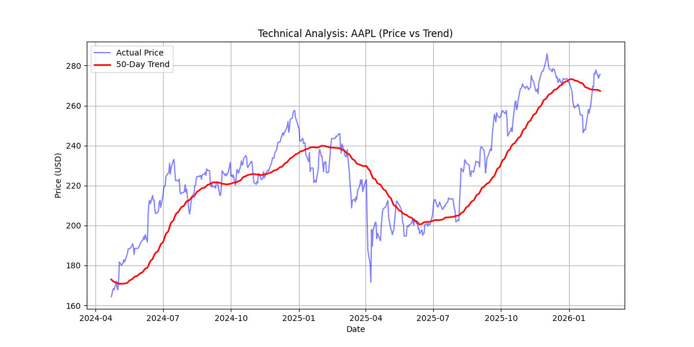

# stock_market_trend_analysis
A scalable ETL pipeline analyzing 50+ global stocks. Automates data ingestion, cleanses volatility metrics, and stores historical trends in SQL. Built with Python, Pandas, and SQLite.
# 📈 Automated Stock Market ETL Pipeline

### **Overview**
This project automates the manual process of tracking and analyzing financial markets. Instead of relying on static Excel sheets, I built a scalable **ETL (Extract, Transform, Load) Pipeline** capable of processing real-time data for over **50 global tickers**—ranging from US Tech giants (Apple, Microsoft) to Indian Market leaders (Reliance, Tata Steel).

The core objective was to build a system that is **fault-tolerant** and capable of handling "dirty" real-world data, such as delisted stocks or time-zone mismatches between NYSE and NSE.

### **Key Features**
* **Batch Data Extraction:** Optimized API calls using `yfinance` to fetch 2 years of historical data for 50+ assets in a single batch request, reducing latency.
* **Robust Error Handling:** Implemented a "Fail-Safe" mechanism. If a specific stock (e.g., a delisted company) fails to fetch, the pipeline logs the error and continues processing the remaining assets instead of crashing.
* **Time-Zone Synchronization:** Solved the "Empty Data" problem caused by different market holidays (US vs. India) using **Forward Fill (`ffill`)** logic to ensure continuous trend lines.
* **Automated Reporting:** Generates instant Matplotlib visualizations comparing actual price vs. the **50-Day Moving Average (Trend)**.
* **SQL Persistence:** processed data is cleaned and stored in a normalized `SQLite` database for historical querying.

### **Tech Stack**
* **Language:** Python 3.13
* **Data Processing:** Pandas, NumPy
* **Database:** SQLite3
* **Visualization:** Matplotlib
* **Data Source:** Yahoo Finance API (`yfinance`)

### **The Architecture (ETL Flow)**
1.  **Extract:** Pipeline connects to Yahoo Finance and pulls raw OHLC data for the defined ticker list.
2.  **Transform:**
    * Aligns timestamps across international markets.
    * Calculates Volatility (Rolling Standard Deviation).
    * Calculates Long-Term Trends (50-Day Moving Average).
    * Removes null values to ensure database integrity.
3.  **Load:** Inserts the clean, structured data into a local `market_data.db` SQL database.
4.  **Report:** Exports `.png` trend analysis charts to the `reports/` directory.

### **How to Run Locally**
1.  Clone the repository:
    ```bash
   git clone https://github.com/roykalp/stock_arket_trend_analysis.git
    ```
2.  Install dependencies:
    ```bash
    pip install pandas matplotlib yfinance
    ```
3.  Run the pipeline:
    ```bash
    python stock_etl_pipeline.py
    ```
4.  Check the `reports` folder for the latest analysis graphs.

### **Output**
_Automated trend analysis identifying an uptrend in Apple (AAPL) stock:_


---
**Author:** Kalpataru Roy

